<p align="center">
  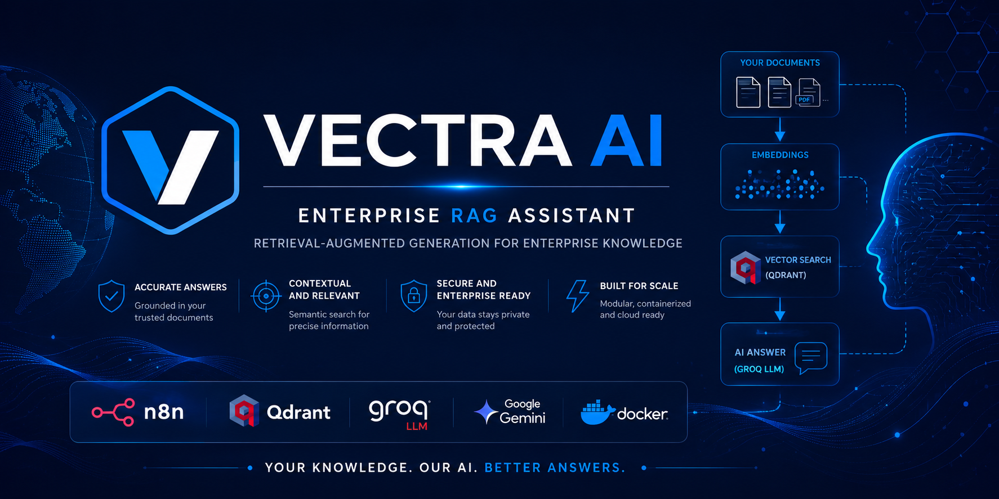
</p>

<h1 align="center">
Vectra AI
</h1>

<p align="center">
Enterprise Retrieval-Augmented Generation (RAG) Assistant for Logistics Knowledge Management
</p>

<p align="center">


</p>

---

> **Enterprise AI Assistant powered by Retrieval-Augmented Generation (RAG), n8n, Qdrant, Google Gemini, Groq and Oracle Cloud Infrastructure.**

---

# Table of Contents

- [Quick Links](#quick-links)
- [Executive Summary](#executive-summary)
- [Telegram Assistant](#telegram-assistant)
- [Project Highlights](#project-highlights)
- [Features](#features)
- [Technology Stack](#technology-stack)
- [Solution Architecture](#solution-architecture)
- [RAG Query Flow](#rag-query-flow)
- [Knowledge Base Ingestion](#knowledge-base-ingestion)
- [Local Development Architecture](#local-development-architecture)
- [Oracle Cloud Production Architecture](#oracle-cloud-production-architecture)
- [Runtime Sequence Diagram](#runtime-sequence-diagram)
- [Repository Structure](#repository-structure)
- [Implemented Workflows](#implemented-workflows)
- [Knowledge Base](#knowledge-base)
- [Docker Environment](#docker-environment)
- [n8n Workflow Automation](#n8n-workflow-automation)
- [Qdrant Vector Database](#qdrant-vector-database)
- [Oracle Cloud Infrastructure](#oracle-cloud-infrastructure)
- [Telegram AI Assistant](#telegram-ai-assistant)
- [Running Locally](#running-locally)
- [Production Deployment](#production-deployment)
- [Documentation](#documentation)
- [Engineering Decisions](#engineering-decisions)
- [Future Improvements](#future-improvements)
- [Project Statistics](#project-statistics)
- [Project Goals](#project-goals)
- [Acknowledgements](#acknowledgements)
- [Author](#author)

---

# Project Documentation

| Documentation | Description |
|---------------|-------------|
| 📦 [Deployment Overview](deployment/README.md) | Production deployment guide |
| 🐳 [Docker](deployment/docker/README.md) | Docker environment and containers |
| ☁️ [Oracle Cloud Infrastructure](deployment/oci/README.md) | Oracle Cloud deployment documentation |
| 🌐 [Cloudflare Tunnel](deployment/cloudflared/README.md) | Previous HTTPS deployment approach (retained for architecture history) |
| ⚙️ [Workflows](workflows/) | Exported n8n workflows |
| 📚 [Knowledge Base](docs/) | AI prompts and corporate documentation |

---

# Executive Summary

Vectra AI is an enterprise Retrieval-Augmented Generation (RAG) assistant designed to answer logistics-related questions using a curated corporate knowledge base.

Instead of relying exclusively on a Large Language Model, the assistant retrieves semantically relevant information from indexed corporate documentation before generating a response. This approach significantly reduces hallucinations while providing contextual, traceable and grounded answers.

The project demonstrates how enterprise AI solutions can combine semantic search, workflow automation, vector databases and cloud infrastructure to build reliable conversational assistants capable of supporting real business operations.

The complete solution integrates:

- Enterprise Knowledge Base
- Retrieval-Augmented Generation (RAG)
- Google Gemini Embeddings
- Groq Large Language Model
- n8n Workflow Automation
- Qdrant Vector Database
- Docker
- Oracle Cloud Infrastructure
- Cloudflare Tunnel
- DuckDNS + Nginx + Let's Encrypt
- Telegram Bot

---

# Telegram Assistant

Vectra AI is available through Telegram, allowing users to interact with the corporate knowledge base using natural language.

The conversational interface hides the complexity of the Retrieval-Augmented Generation pipeline, providing fast, contextual and traceable answers.

<p align="center">
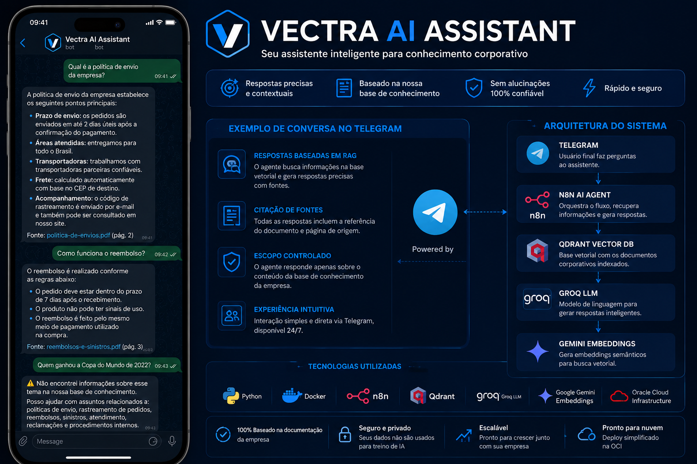
</p>

---

# Project Highlights

- ✅ Enterprise Retrieval-Augmented Generation (RAG)
- ✅ Corporate Knowledge Base
- ✅ Automated PDF Processing
- ✅ Google Gemini Embeddings
- ✅ Groq Response Generation
- ✅ Qdrant Vector Database
- ✅ n8n Workflow Automation
- ✅ Oracle Cloud Deployment
- ✅ DuckDNS Persistent Domain
- ✅ Nginx Reverse Proxy
- ✅ Let's Encrypt HTTPS
- ✅ Telegram Conversational Assistant
- ✅ Dockerized Infrastructure
- ✅ End-to-End Production Validation

---

# Features

## Enterprise Knowledge Retrieval

- Semantic search
- Context-aware responses
- Source attribution
- Hallucination mitigation
- Grounded answer generation

---

## Workflow Automation

- Automated document ingestion
- PDF processing
- Embedding generation
- Vector indexing
- AI orchestration
- Telegram integration

---

## Production Infrastructure

- Docker Compose
- Oracle Cloud Infrastructure
- Cloudflare Tunnel
- Persistent Docker volumes
- Secure HTTPS access

---

# Technology Stack

Vectra AI combines modern AI technologies with enterprise infrastructure components.

<p align="center">
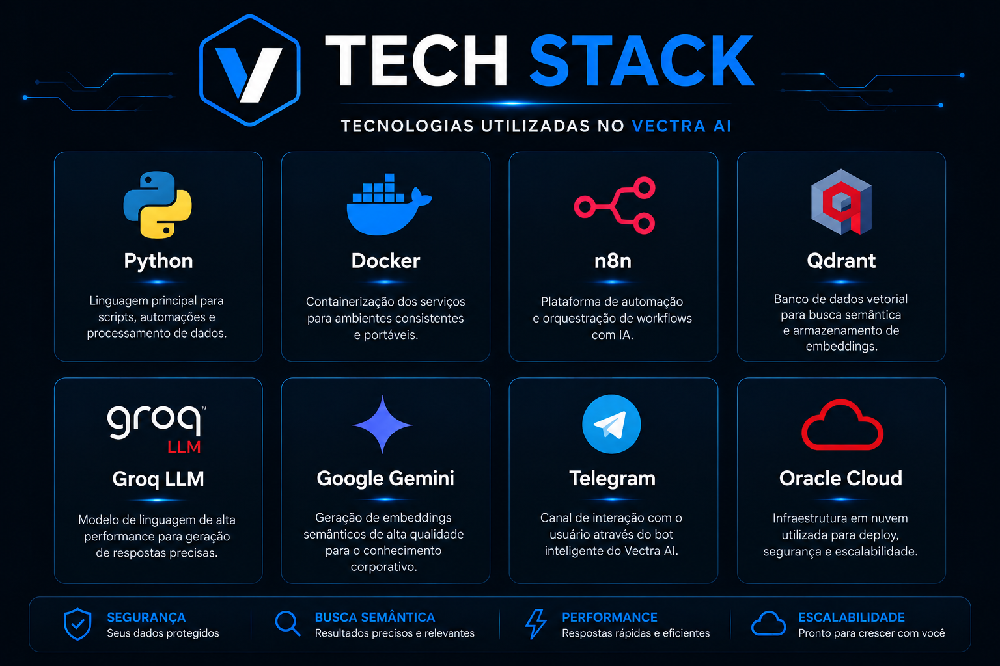
</p>

| Layer | Technology |
|------|------------|
| Programming Language | Python |
| Workflow Automation | n8n |
| Vector Database | Qdrant |
| Embeddings | Google Gemini |
| Large Language Model | Qwen 3.6 27B |
| LLM Inference Provider | Groq |
| Containerization | Docker |
| Cloud Infrastructure | Oracle Cloud Infrastructure |
| Domain Resolution | DuckDNS |
| Reverse Proxy | Nginx |
| TLS / HTTPS | Let's Encrypt |
| Messaging Platform | Telegram |

---

# Solution Architecture

The architecture separates knowledge management from conversational interaction.

<p align="center">
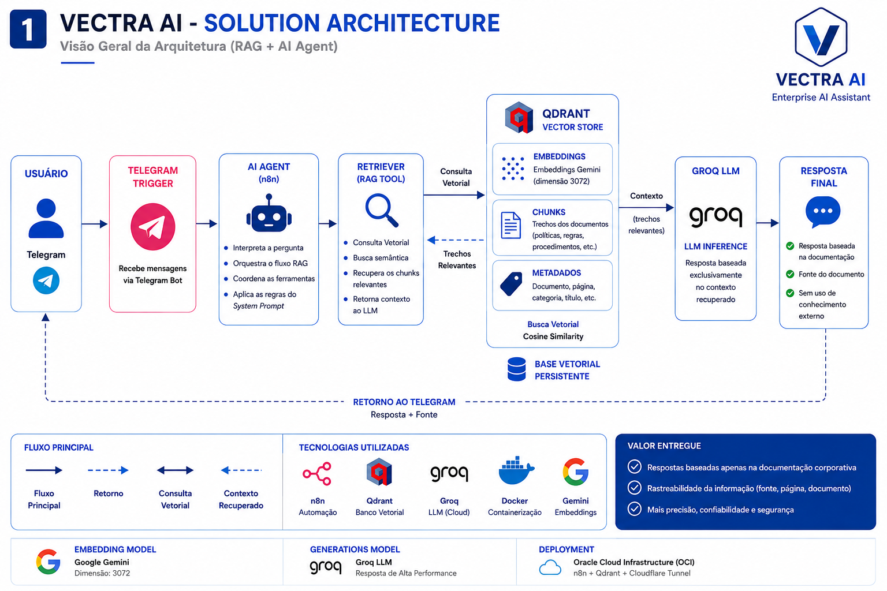
</p>

The platform consists of:

- Corporate Documentation
- Knowledge Processing
- Embedding Generation
- Vector Database
- AI Agent
- Response Generation
- Telegram Interface

Each layer has a clearly defined responsibility, allowing the solution to scale while maintaining separation of concerns.

---

# RAG Query Flow

The following diagram illustrates how every user request is processed.

<p align="center">
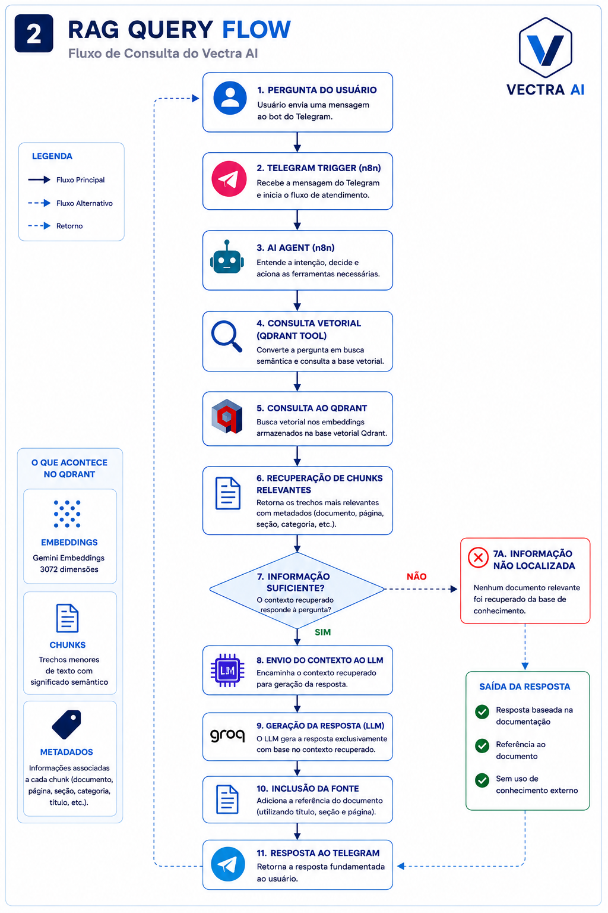
</p>

Execution flow:

1. User sends a message.
2. Telegram forwards the request.
3. n8n orchestrates the workflow.
4. Google Gemini generates the embedding.
5. Qdrant retrieves relevant document chunks.
6. Groq receives the retrieved context.
7. The assistant generates a grounded response.
8. Telegram delivers the answer to the user.

---

# Knowledge Base Ingestion

Before users can interact with the assistant, enterprise documentation must be transformed into vector embeddings.

The ingestion workflow performs:

- PDF loading
- Document parsing
- Text chunking
- Embedding generation
- Metadata association
- Vector storage

<p align="center">
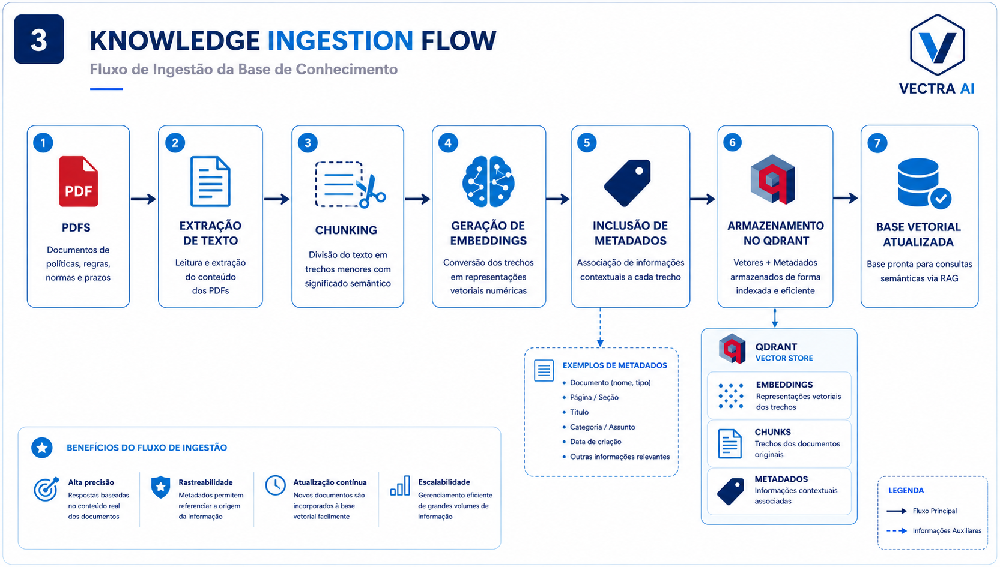
</p>

This process converts static corporate documentation into searchable semantic knowledge.

---

# Local Development Architecture

The development environment is fully containerized using Docker Compose.

<p align="center">
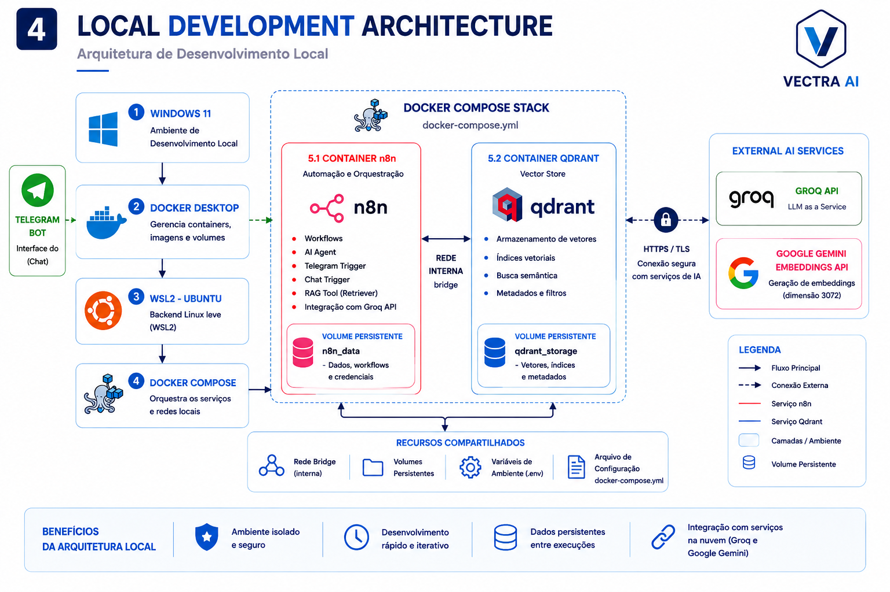
</p>

Local services include:

- n8n
- Qdrant
- Mounted Knowledge Base
- Docker Volumes
- Google Gemini API
- Groq API

This configuration enables local development while closely matching the production environment.

---

# Oracle Cloud Production Architecture

The production environment is hosted on Oracle Cloud Infrastructure.

<p align="center">
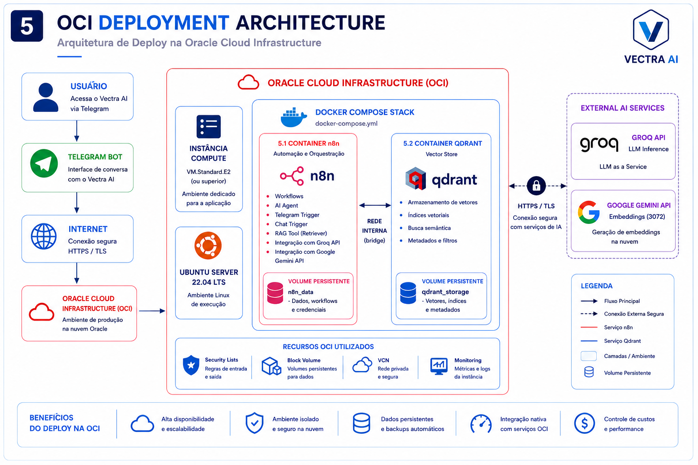
</p>

Production components include:

- Oracle Cloud Virtual Machine
- Ubuntu Server
- Docker Engine
- Docker Compose
- n8n
- Qdrant
- DuckDNS
- Nginx Reverse Proxy
- Let's Encrypt
- Telegram Bot
- Persistent Storage

The platform provides persistent domain resolution and secure HTTPS access through Nginx and Let's Encrypt while keeping application services containerized within the Oracle Cloud environment.

---

# Runtime Sequence Diagram

The following sequence diagram illustrates the interaction between every component involved in a typical request.

<p align="center">
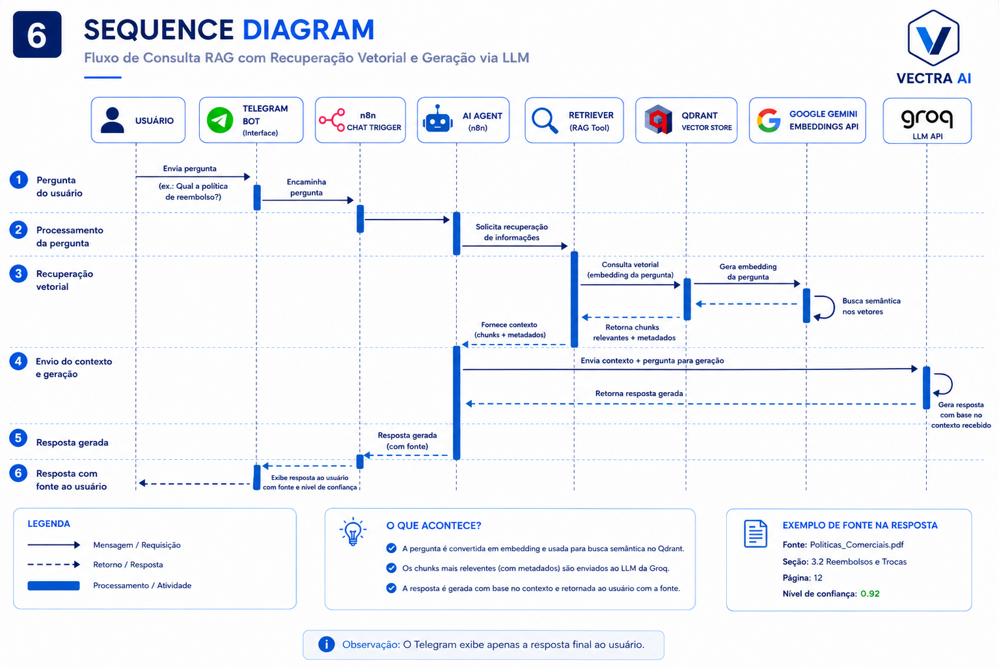
</p>

The sequence demonstrates how requests travel from Telegram to the AI assistant while preserving traceability through Retrieval-Augmented Generation.

---

# Repository Structure

The repository follows a modular organization that separates application code, deployment resources, documentation and supporting assets.

```text
vectra-ai/
│
├── assets/
│   ├── diagrams/
│   ├── logo/
│   └── screenshots/
│
├── deployment/
│   ├── cloudflared/
│   ├── docker/
│   └── oci/
│
├── docs/
│   ├── ai/
│   ├── knowledge/
│   └── pdf/
│
├── evidence/
│
├── scripts/
│
├── workflows/
│
├── docker-compose.yml
├── README.md
└── requirements.txt
```

The modular layout allows each component of the solution to evolve independently while keeping the project organized and maintainable.

---

# Implemented Workflows

Vectra AI is composed of three independent workflows, each responsible for a specific stage of the Retrieval-Augmented Generation pipeline.

| Workflow | Description | Status |
|-----------|-------------|:------:|
| 01 - Knowledge Base Ingestion | Reads corporate PDFs and stores vector embeddings in Qdrant | ✅ |
| 02 - RAG Query Engine | Retrieves relevant knowledge and generates grounded responses | ✅ |
| 03 - Telegram Assistant | Conversational interface for end users | ✅ |

Keeping these workflows independent improves maintainability and allows the knowledge base to evolve without impacting runtime conversations.

---

# Knowledge Base

The assistant relies on a curated enterprise knowledge base composed of logistics documentation maintained in Markdown.

During the ingestion process, these documents are automatically converted into PDF files, embedded using Google Gemini and indexed inside Qdrant.

Current knowledge domains include:

- Shipping Policies
- Order Tracking
- Refunds
- Claims Management
- Customer Service
- Frequently Asked Questions
- Internal Procedures

This approach keeps business documentation synchronized with the AI assistant while simplifying long-term maintenance.

---

# Docker Environment

The entire platform runs inside Docker containers.

Containerization guarantees reproducible environments, simplified deployment and isolated services.

---

## Running Containers

<p align="center">
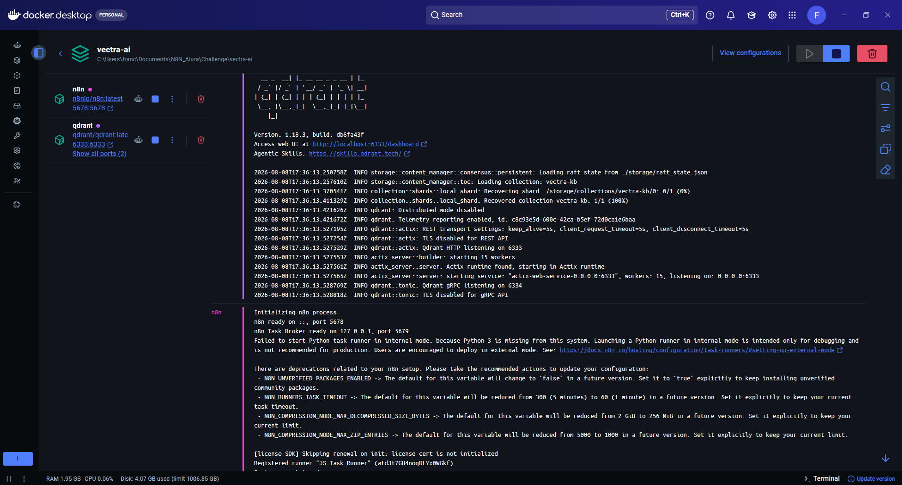
</p>

The production environment runs two primary containers:

- vectra-n8n
- vectra-qdrant

---

## Container Overview

<p align="center">
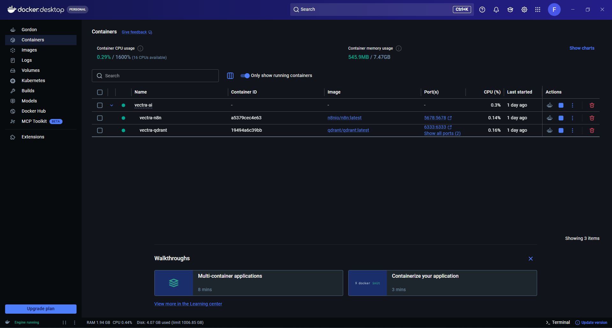
</p>

Docker Compose orchestrates communication between the application services while keeping internal networking isolated.

---

## Docker Images

<p align="center">
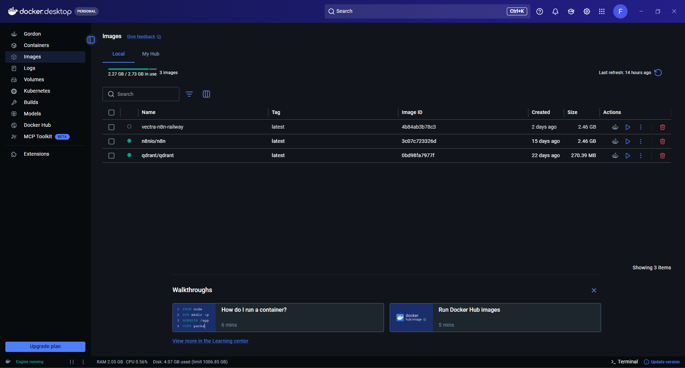
</p>

Official Docker images are used as the foundation for the production deployment.

---

## Persistent Storage

<p align="center">
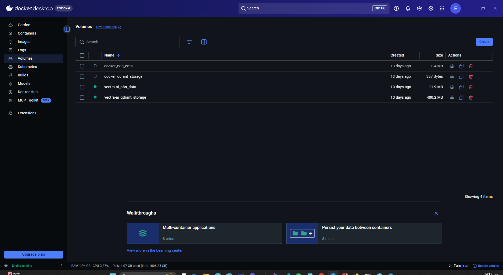
</p>

Persistent Docker volumes preserve:

- Workflow definitions
- Credentials
- Configuration files
- Vector collections
- Embeddings

This allows containers to be recreated without losing application data.

---

## Container Logs

<p align="center">
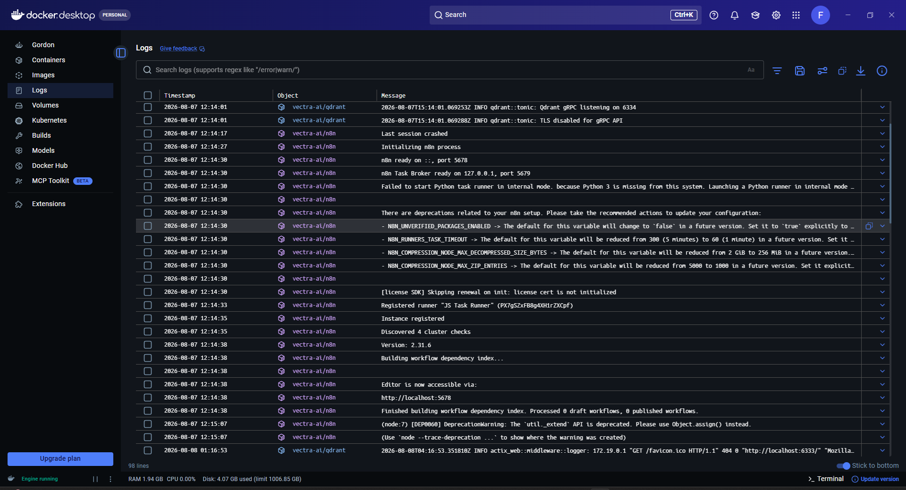
</p>

Runtime logs were exported and archived as deployment evidence, validating successful container execution.

---

# n8n Workflow Automation

n8n is responsible for orchestrating every stage of the Retrieval-Augmented Generation pipeline.

Responsibilities include:

- Document ingestion
- AI Agent execution
- Semantic retrieval
- Telegram communication
- Response generation

---

## Workflow Overview

<p align="center">
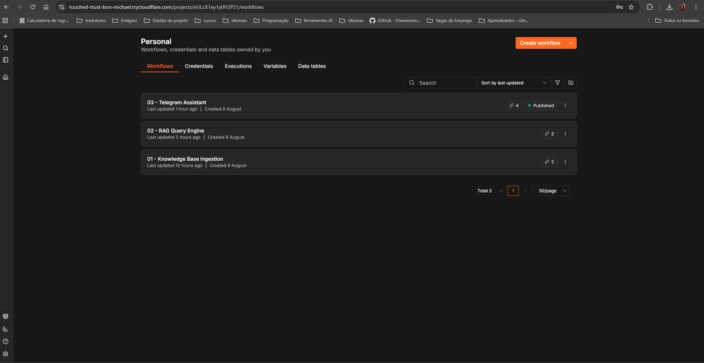
</p>

Three independent workflows compose the production environment.

---

## Knowledge Base Ingestion Workflow

<p align="center">
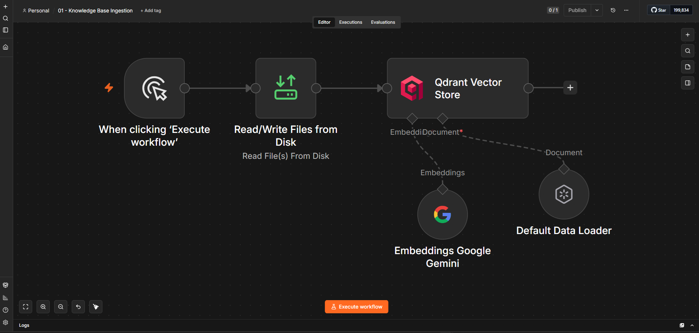
</p>

This workflow transforms enterprise documentation into searchable semantic vectors.

Processing stages include:

- PDF Loading
- Chunking
- Embedding Generation
- Metadata Association
- Vector Storage

---

## RAG Query Engine

<p align="center">
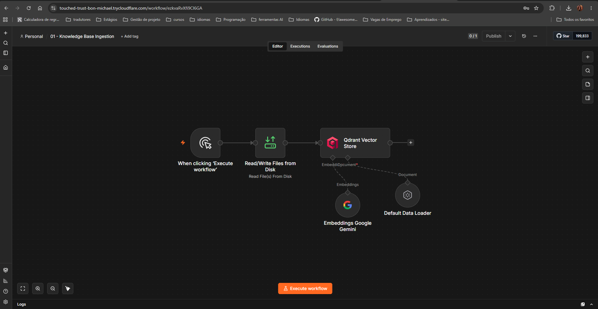
</p>

Whenever a user asks a question, this workflow retrieves the most relevant document chunks before invoking the language model.

The response is always grounded on retrieved corporate knowledge.

---

## Telegram Assistant Workflow

<p align="center">
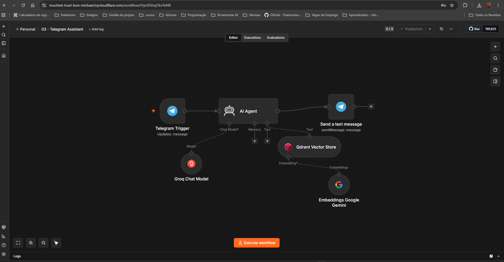
</p>

The Telegram workflow provides the external conversational interface while reusing the same Retrieval-Augmented Generation pipeline.

---

## Workflow Execution

<p align="center">
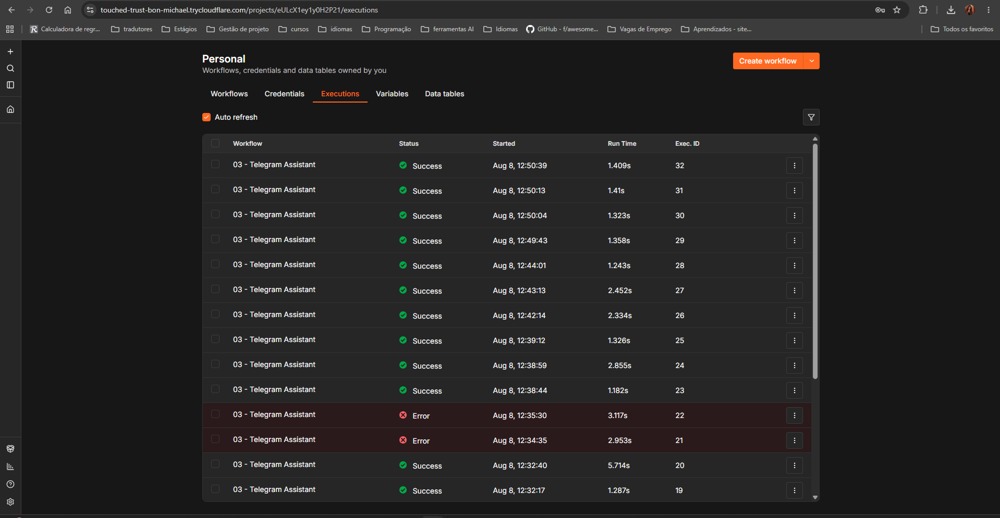
</p>

Execution logs demonstrate successful end-to-end processing.

---

## Credentials

<p align="center">
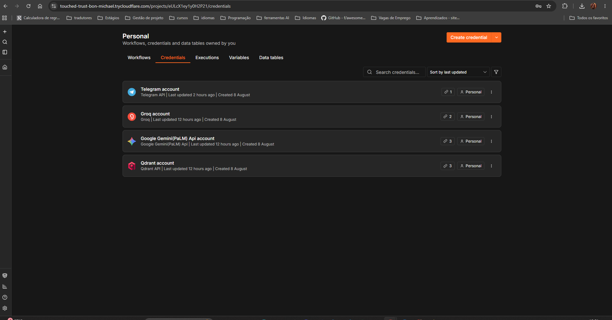
</p>

External services are configured through n8n Credentials.

Sensitive values remain outside the repository and are never committed to source control.

---

# Qdrant Vector Database

Qdrant stores semantic representations of the enterprise knowledge base.

The vector database enables semantic similarity search, allowing the assistant to retrieve only the most relevant documentation before generating an answer.

Production validation confirmed:

- Collection status: green
- 50 indexed document chunks
- 3072-dimensional vectors
- Cosine similarity search
- Persistent Docker volume
- Snapshot backup successfully validated

---

## Collections

<p align="center">
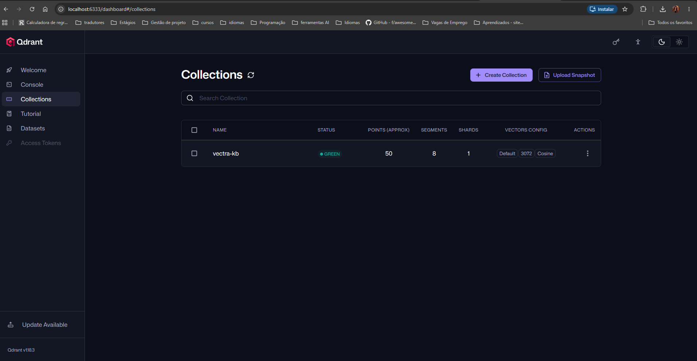
</p>

The production environment uses a dedicated collection named:

```text
vectra-kb
```

---

## Collection Details

<p align="center">
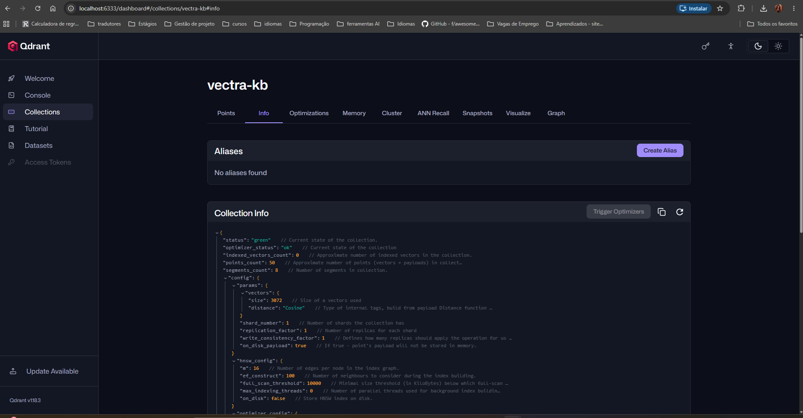
</p>

Production validation confirmed:

- Cosine similarity search
- Metadata indexing
- Optimized vector storage
- 50 indexed document chunks

---

# Oracle Cloud Infrastructure

Vectra AI has been successfully deployed to Oracle Cloud Infrastructure.

The production environment includes:

- Ubuntu Server
- Docker Engine
- Docker Compose
- n8n
- Qdrant
- Nginx
- DuckDNS
- Let's Encrypt

---

## Oracle Cloud Compute Instance

<p align="center">

</p>

The Oracle Cloud Virtual Machine hosts the complete production environment.

All application services execute inside Docker containers.

---

## Remote Administration

<p align="center">
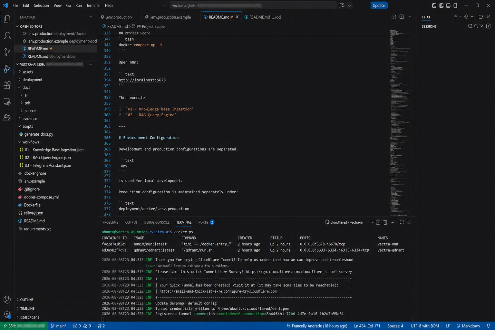
</p>

The production server is managed remotely using Visual Studio Code Remote SSH.

This provides a seamless development experience while maintaining direct access to the production environment hosted on Oracle Cloud Infrastructure.

---

# Production Validation

The complete production deployment has been successfully validated.

| Component | Status |
|-----------|:------:|
| Docker | ✅ |
| n8n | ✅ |
| Qdrant | ✅ |
| Google Gemini | ✅ |
| Groq | ✅ |
| RAG Retrieval | ✅ |
| Source Attribution | ✅ |
| Oracle Cloud Infrastructure | ✅ |
| DuckDNS | ✅ |
| Nginx Reverse Proxy | ✅ |
| Let's Encrypt HTTPS | ✅ |
| Telegram Assistant | ✅ |

---

# LLM Evaluation

A controlled model evaluation was performed using the same RAG architecture, knowledge base, embeddings, system prompt and Qdrant retrieval configuration.

The objective was to compare answer quality, groundedness, tool-calling behavior, latency and operational reliability under real workflow conditions.

| Model | Tool Calling | Answer Quality | Operational Behavior | Result |
|-------|:------------:|---------------|----------------------|--------|
| Qwen 3.6 27B | ✅ | High | Best overall balance between response quality, tool usage and operational stability | **Selected** |
| GPT-OSS 120B | ✅ | High | Strong responses when completed, but repeated agent/tool cycles triggered rate-limit events | Evaluated |
| GPT-OSS 20B | ✅ | Good | Similar rate-limit behavior and inconsistent handling in some test cases | Evaluated |
| Compound Mini | ❌ | Not evaluated | Tool calling unsupported in the tested configuration | Incompatible |

The evaluation included direct factual questions, multi-document synthesis, out-of-scope requests, missing-information scenarios and sequential-query stress tests.

Qwen 3.6 27B was selected as the production model because it provided the best overall balance for the current Vectra AI architecture.

These results reflect the tested architecture and API limits and should not be interpreted as a universal benchmark between the models.

----

# Telegram AI Assistant

The Telegram Bot provides the primary user interface for Vectra AI.

Instead of interacting directly with the Retrieval-Augmented Generation pipeline, users communicate naturally through Telegram while the platform transparently performs semantic search, retrieves relevant corporate documentation and generates grounded responses.

Every answer is produced exclusively from the indexed enterprise knowledge base.

---

## Finding the Assistant

<p align="center">
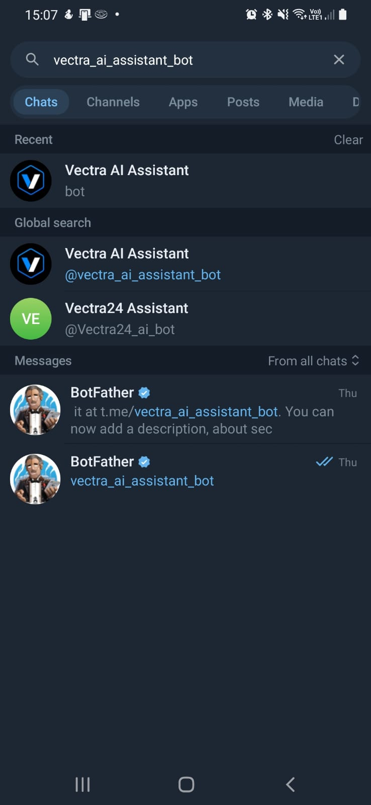
</p>

Users can easily locate the assistant through the Telegram platform.

---

## Starting the Assistant

<p align="center">
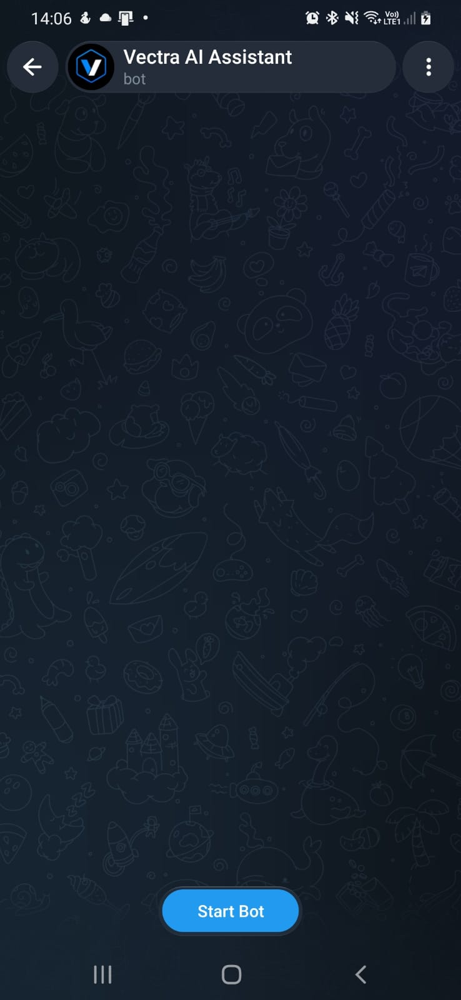
</p>

The conversation begins using the standard **/start** command.

The assistant introduces itself before accepting business-related questions.

---

## Welcome Message

<p align="center">
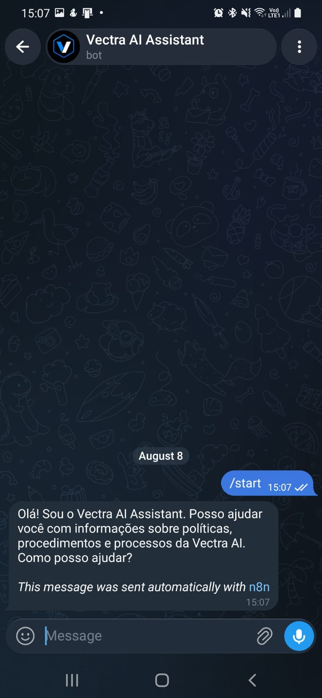
</p>

The assistant explains its purpose and informs users that answers are generated exclusively from the corporate knowledge base.

---

## Example — Shipping Policies

<p align="center">
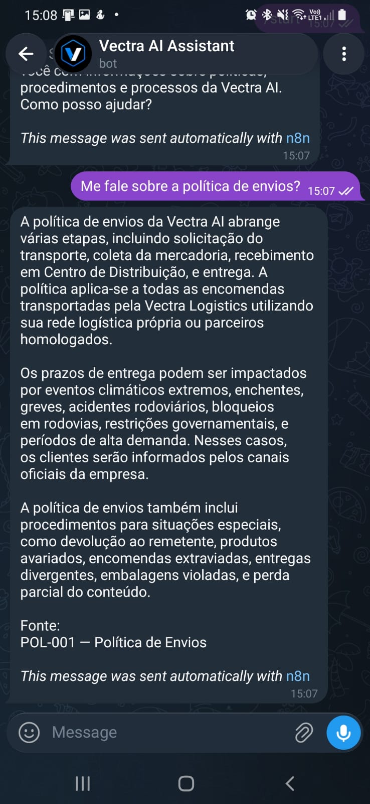
</p>

Vectra AI retrieves and summarizes information regarding shipping policies directly from the indexed documentation.

---

## Example — Refund Policies

<p align="center">
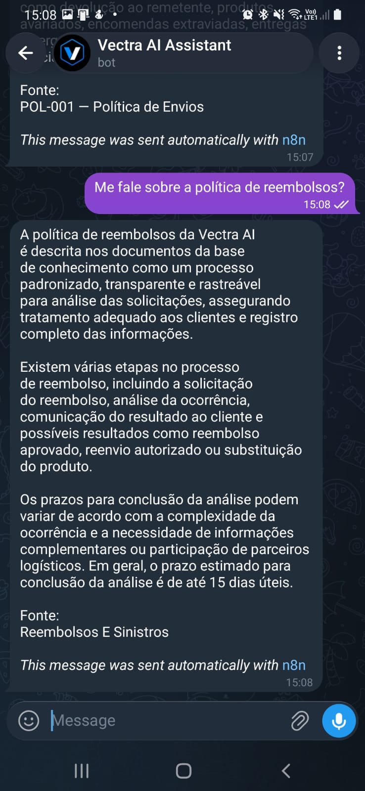
</p>

Responses remain contextual, traceable and grounded on enterprise knowledge.

---

## Example — Customer Complaints

<p align="center">
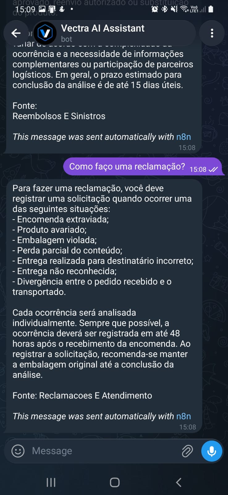
</p>

The assistant retrieves only the documentation relevant to the user's request.

---

## Example — Shipment Loss

<p align="center">
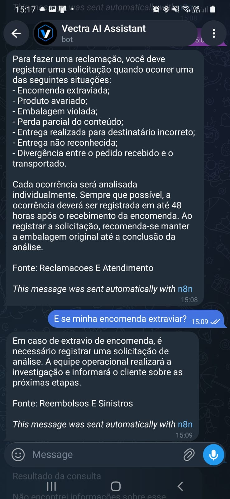
</p>

Business procedures regarding shipment incidents are retrieved from the knowledge base before response generation.

---

## Out-of-Domain Protection

<p align="center">
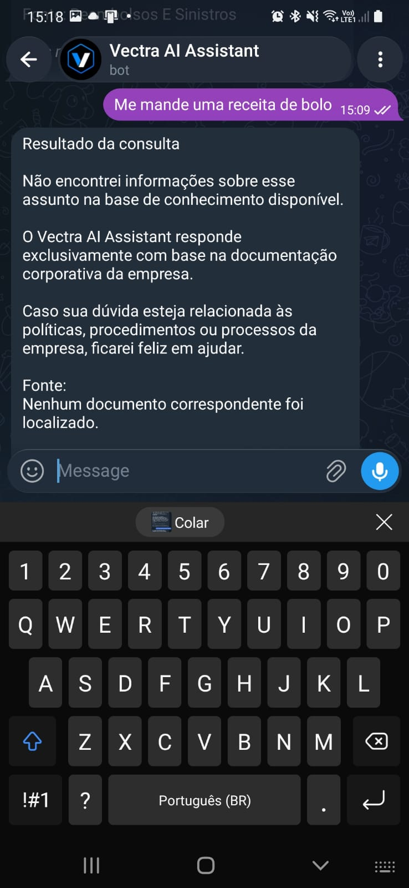
</p>

Questions outside the enterprise knowledge base are gracefully rejected.

This behavior demonstrates one of the fundamental principles of Retrieval-Augmented Generation: never fabricate information when no supporting documentation exists.

---

# Running Locally

Clone the repository:

```bash
git clone https://github.com/francellymca/vectra-ai.git

cd vectra-ai
```

Start the development environment:

```bash
docker compose up -d
```

Open n8n:

```text
http://localhost:5678
```

Execute the workflows in the following order:

1. Knowledge Base Ingestion
2. RAG Query Engine
3. Telegram Assistant

---

# Production Deployment

Vectra AI has been successfully deployed and validated on Oracle Cloud Infrastructure.

The current production environment includes:

- Oracle Cloud Virtual Machine
- Ubuntu Server
- Docker Engine
- Docker Compose
- n8n
- Qdrant
- Google Gemini Embeddings
- Qwen 3.6 27B
- Groq Inference API
- DuckDNS
- Nginx Reverse Proxy
- Let's Encrypt HTTPS
- Telegram Bot


Deployment documentation is available in:

```text
deployment/
├── README.md
├── docker/
├── cloudflared/
└── oci/
```

Each component includes its own implementation guide and deployment instructions.

---

# Documentation

The repository contains dedicated documentation for every major component.

| Documentation | Description |
|--------------|-------------|
| deployment/README.md | Production deployment overview |
| deployment/docker | Docker infrastructure |
| deployment/cloudflared | HTTPS access configuration |
| deployment/oci | Oracle Cloud deployment |
| docs | Knowledge Base and AI documentation |
| workflows | Exported n8n workflows |
| scripts | Supporting automation scripts |

This modular documentation keeps implementation details separated from the main project overview.

---

# Engineering Decisions

Several architectural decisions were intentionally adopted throughout the project.

### Markdown as the Single Source of Truth

Corporate documentation is maintained in Markdown before being automatically converted into PDF files for ingestion.

---

### Separation of Responsibilities

Knowledge ingestion and conversational interaction are implemented as independent workflows.

This separation allows documentation updates without modifying runtime behavior.

---

### AI Models and Inference

Google Gemini is responsible for generating semantic embeddings used to index and retrieve enterprise knowledge from Qdrant.

Qwen 3.6 27B serves as the production Large Language Model (LLM), generating grounded responses based on the context retrieved by the RAG pipeline.

Groq provides the inference infrastructure used to execute the production LLM with low-latency response generation.

Separating embedding generation, language model inference and vector retrieval allows each component to be independently optimized and maintained.

---

### Containerized Infrastructure

Both development and production environments rely on Docker Compose.

This guarantees reproducibility while reducing deployment complexity.

---

### Grounded Responses

Vectra AI never generates answers using external knowledge.

Every response is grounded on the retrieved corporate documentation, significantly reducing hallucinations.

---

# Future Improvements

Although the project is functionally complete, future iterations could include:

- Authentication and role-based access control
- Multi-user conversations
- Hybrid retrieval
- Knowledge Base versioning
- CI/CD pipeline
- Monitoring and observability
- Multi-language documentation
- Additional messaging channels
- Additional vector database providers

---

# Project Statistics

| Category | Value |
|----------|------:|
| Production AI Models | 2 |
| LLMs Evaluated | 4 |
| Vector Database | 1 |
| Docker Containers | 2 |
| n8n Workflows | 3 |
| Cloud Provider | 1 |
| Messaging Platform | Telegram |
| Knowledge Domains | 6 |
| Indexed Document Chunks | 50 |
| Vector Dimensions | 3072 |

---

# Project Goals

This project demonstrates practical experience with:

- Enterprise Artificial Intelligence
- Retrieval-Augmented Generation (RAG)
- Prompt Engineering
- LLM Evaluation and Model Selection
- Semantic Search and Vector Retrieval
- Workflow Automation
- Vector Databases
- Docker and Containerized Services
- Oracle Cloud Infrastructure
- Linux Server Administration
- Reverse Proxy Configuration with Nginx
- DNS and HTTPS Configuration
- Production Deployment and Validation
- Backup and Data Persistence
- Enterprise AI Architecture

---

# Acknowledgements

This project was developed as part of the **Alura Agent Challenge**.

Its objective was to design, implement and deploy an enterprise-grade Retrieval-Augmented Generation assistant using modern AI technologies, workflow automation and cloud infrastructure while following software engineering best practices.

---

# Author

## Francelly Andrade

Electrical Engineer focused on Artificial Intelligence, Automation, Data Engineering and Cloud-based solutions.

Vectra AI was developed as a portfolio project to demonstrate practical experience in:

- Enterprise Artificial Intelligence
- Retrieval-Augmented Generation (RAG)
- LLM Evaluation and Model Selection
- Semantic Search and Vector Databases
- Workflow Automation with n8n
- Docker and Containerized Applications
- Oracle Cloud Infrastructure
- Linux Server Administration
- Production AI Deployment
- DNS, Reverse Proxy and HTTPS Configuration
- Backup and Data Persistence
- Software Engineering and Technical Documentation

GitHub:

**https://github.com/francellymca**
