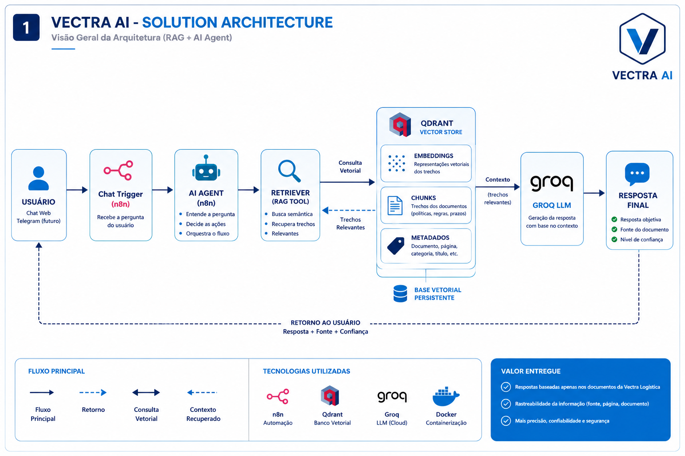
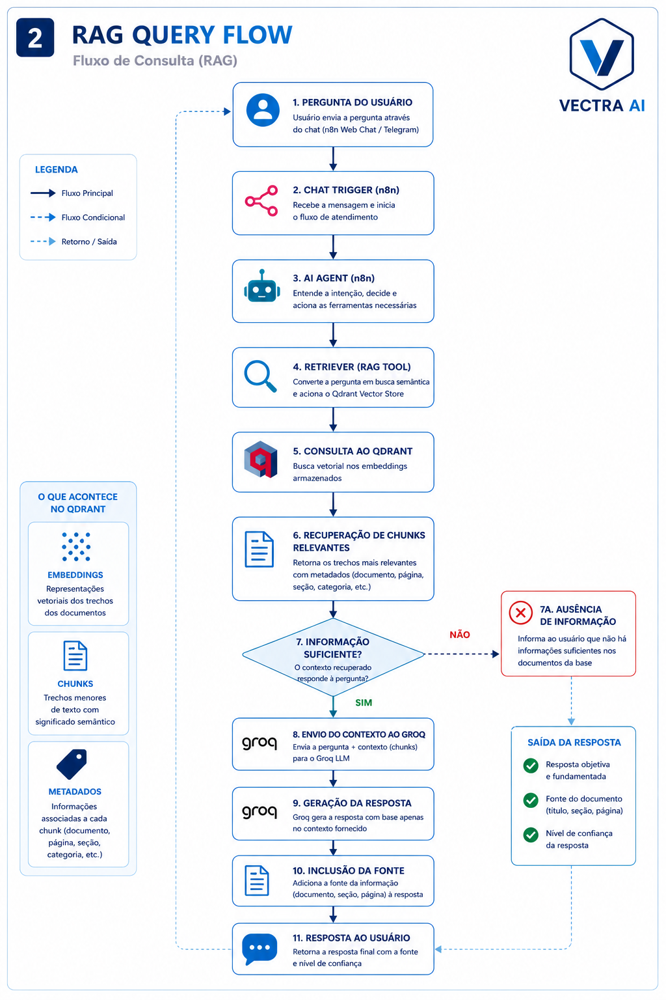

# Vectra AI

> Enterprise Retrieval-Augmented Generation (RAG) Assistant for Logistics Knowledge Management


---

# Executive Summary

Vectra AI is an enterprise-oriented Retrieval-Augmented Generation (RAG) assistant designed to answer logistics-related questions using a curated corporate knowledge base.

Instead of relying exclusively on Large Language Models, the assistant retrieves semantically relevant information from indexed corporate documentation before generating responses. This approach significantly reduces hallucinations while providing contextual, traceable and reliable answers.

The project combines workflow automation, vector search and modern LLMs to simulate a real-world enterprise knowledge assistant.

---

# Current Status

| Property | Value |
|-----------|-------|
| Status | 🟢 In Development |
| Current Version | **v0.6.0** |
| Architecture | Enterprise Retrieval-Augmented Generation |
| Development Stage | Functional RAG Prototype |
| Cloud Deployment | Planned (Oracle Cloud Infrastructure) |

## Development Progress

| Component | Status |
|-----------|--------|
| Docker Environment | ✅ Completed |
| Corporate Knowledge Base | ✅ Completed |
| Automated PDF Generator | ✅ Completed |
| Qdrant Vector Database | ✅ Completed |
| Knowledge Base Ingestion Workflow | ✅ Completed |
| Gemini Embeddings | ✅ Completed |
| RAG Query Workflow | ✅ Completed |
| Vectra AI Assistant | ✅ Completed |
| Telegram Integration | ⏳ Planned |
| Oracle Cloud Deployment | ⏳ Planned |

---

# Why Vectra AI?

Corporate knowledge is frequently distributed across multiple documents, making information retrieval inefficient and difficult to maintain.

Vectra AI addresses this challenge by combining semantic search, Retrieval-Augmented Generation (RAG), workflow automation and vector databases to provide accurate, grounded and traceable answers based exclusively on corporate documentation.

---

# Solution Overview

The solution is organized into four independent layers.

```text
Corporate Knowledge
        │
        ▼
Knowledge Processing
        │
        ▼
AI Orchestration
        │
        ▼
Response Generation
```

This layered architecture separates knowledge ingestion from user interaction, allowing the documentation to evolve independently from the conversational assistant.

---

# Solution Architecture



The solution is composed of four major components:

- Corporate Knowledge Base
- Vector Database (Qdrant)
- AI Orchestration (n8n)
- Response Generation (Groq)

---

# RAG Query Flow



The Retrieval-Augmented Generation workflow performs the following steps:

1. The user submits a question.
2. The AI Agent determines whether the corporate knowledge base should be queried.
3. Google Gemini generates the semantic embedding for the user question.
4. Qdrant retrieves the most relevant document chunks.
5. Groq generates a grounded response using the retrieved context.
6. The assistant returns the answer together with the corresponding source whenever available.

---

# Technology Stack

| Layer | Technology |
|--------|------------|
| Programming Language | Python |
| Workflow Automation | n8n |
| Vector Database | Qdrant |
| Embeddings | Google Gemini |
| Large Language Model | Groq |
| Containerization | Docker |
| Documentation | Markdown + Python |
| Cloud Deployment | Oracle Cloud Infrastructure (Planned) |

---

# Repository Structure

```text
vectra-ai/

assets/
deployment/
diagrams/
docs/
│
├── source/
├── pdf/
└── ai/

screenshots/
scripts/
tests/
workflows/

docker-compose.yml
README.md
requirements.txt
```

---

# Engineering Decisions

The project was intentionally designed following software engineering principles commonly adopted in enterprise AI systems.

## Markdown as the Single Source of Truth

All corporate documentation is maintained in Markdown.

PDF documents are automatically generated from Markdown, ensuring consistency while simplifying future maintenance.

---

## Separation of Responsibilities

Knowledge ingestion and question answering are implemented as independent workflows.

This separation allows the knowledge base to be updated without affecting runtime query execution.

---

## Dedicated Embedding Model

Google Gemini is used exclusively for semantic embedding generation.

Groq is dedicated to response generation, allowing each model to perform the task for which it is best suited.

---

## Containerized Development

The entire development environment runs inside Docker Compose.

This guarantees reproducibility across different machines and simplifies deployment.

---

# Core Components

| Component | Description |
|-----------|-------------|
| Corporate Knowledge Base | Business documentation maintained in Markdown |
| Documentation Builder | Automatic PDF generation pipeline |
| Knowledge Base Ingestion | Reads and indexes corporate documents |
| Vector Database | Semantic search using Qdrant |
| Vectra AI Assistant | Enterprise conversational assistant |
| Retrieval Engine | Retrieves relevant knowledge from the vector database |
| Response Generator | Generates grounded responses using Groq |

---

# Implemented Workflows

| Workflow | Purpose | Status |
|-----------|----------|--------|
| 01 - Knowledge Base Ingestion | Reads corporate PDF documents, generates embeddings and stores vectors inside Qdrant | ✅ |
| 02 - RAG Query Engine | Retrieves corporate knowledge and generates grounded responses | ✅ |
| 03 - Telegram Assistant | Conversational interface | ⏳ |
| 04 - OCI Deployment | Cloud deployment | ⏳ |

---

# Knowledge Base Ingestion


The ingestion workflow performs:

- Reading PDF documents
- Extracting document content
- Splitting text into semantic chunks
- Generating embeddings using Google Gemini
- Associating metadata
- Storing vectors in Qdrant

---

# Vectra AI Assistant

The Vectra AI Assistant is the conversational layer of the platform.

It answers questions exclusively using information retrieved from the corporate knowledge base.

The assistant follows four fundamental principles:

- Retrieval before generation.
- Grounded responses.
- Source attribution whenever available.
- Graceful fallback when no relevant information is found.

---

# Running Locally

Clone the repository.

```bash
git clone https://github.com/francellymca/vectra-ai.git
```

Start the Docker environment.

```bash
docker compose up -d
```

Open n8n.

```text
http://localhost:5678
```

Execute:

1. Workflow 01 – Knowledge Base Ingestion.
2. Workflow 02 – RAG Query Engine.

---

# Architecture Documentation

The repository includes detailed architectural documentation covering every major component of the solution.

Available diagrams include:

- Solution Architecture
- Knowledge Ingestion Pipeline
- RAG Query Flow
- Local Development Architecture
- Oracle Cloud Deployment Architecture
- Runtime Sequence Diagram

---

# Roadmap

- [x] Project structure
- [x] Docker environment
- [x] Corporate knowledge base
- [x] Automated PDF generation
- [x] Qdrant integration
- [x] Knowledge ingestion workflow
- [x] Retrieval-Augmented Generation
- [x] Vectra AI Assistant
- [ ] Telegram integration
- [ ] Oracle Cloud deployment
- [ ] Final demonstration
- [ ] Production documentation

---

# Project Scope

Vectra AI is an educational and portfolio project focused on exploring enterprise Retrieval-Augmented Generation (RAG), workflow automation and cloud-native AI architectures.

Rather than providing a production-ready application, the project emphasizes software engineering principles, maintainability, modular architecture and practical AI integration strategies commonly found in enterprise environments.