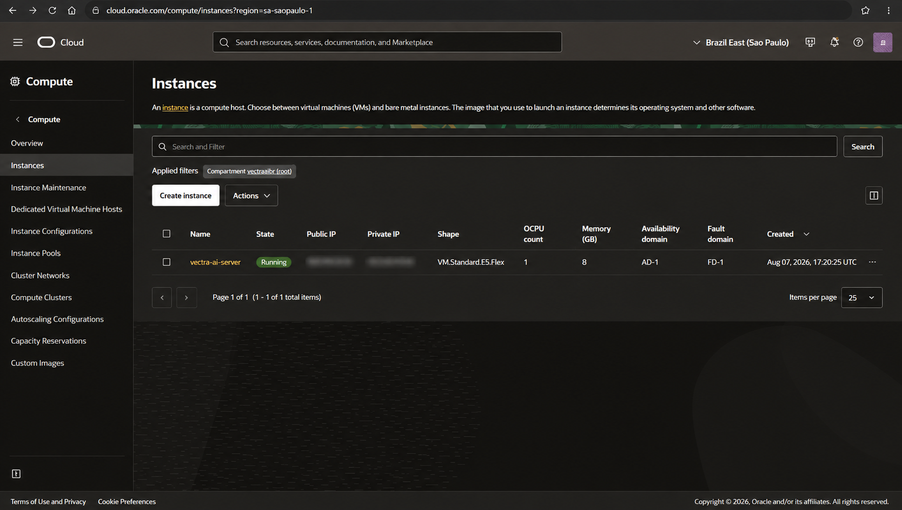

# Oracle Cloud Infrastructure Deployment

This document describes the production deployment of **Vectra AI** on **Oracle Cloud Infrastructure (OCI)**.

The production environment hosts the complete Retrieval-Augmented Generation (RAG) platform, including Docker, n8n, Qdrant, Cloudflare Tunnel and the Telegram AI Assistant.

---

# Deployment Status

| Component | Status |
|-----------|:------:|
| OCI Compute Instance | ✅ Completed |
| Ubuntu Server | ✅ Completed |
| SSH Access | ✅ Completed |
| Docker Engine | ✅ Completed |
| Docker Compose | ✅ Completed |
| Repository Deployment | ✅ Completed |
| Production Environment Variables | ✅ Completed |
| n8n Container | ✅ Running |
| Qdrant Container | ✅ Running |
| Knowledge Base Ingestion | ✅ Validated |
| RAG Query Engine | ✅ Validated |
| Cloudflare HTTPS Tunnel | ✅ Validated |
| Telegram Integration | ✅ Validated |
| Deployment Evidence | ✅ Completed |

---

# Production Architecture

```text
                 Internet
                      │
                      ▼
             Cloudflare Tunnel
                  HTTPS
                      │
                      ▼
            OCI Compute Instance
                      │
               Docker Compose
                      │
          ┌───────────┴───────────┐
          ▼                       ▼
        n8n                   Qdrant
          │
          ▼
   Gemini Embeddings
          │
          ▼
      Groq LLM
          │
          ▼
 Telegram AI Assistant
```

The application runs on an Oracle Cloud Infrastructure Ubuntu compute instance using Docker Compose. External HTTPS connectivity is provided through Cloudflare Tunnel without exposing the n8n application directly to the Internet.

---

# OCI Compute Instance



The Oracle Cloud Infrastructure Compute Instance hosts the complete Vectra AI production environment, including Docker, n8n, Qdrant and Cloudflare Tunnel.

| Property | Configuration |
|----------|---------------|
| Operating System | Ubuntu 24.04 LTS |
| Architecture | x86_64 |
| Shape | VM.Standard.E5.Flex |
| OCPUs | 1 |
| Memory | 8 GB |
| Public Network | Enabled |
| Private Subnet Addressing | Enabled |
| SSH Authentication | Public Key |

---

# Network Architecture

The OCI environment includes:

- Virtual Cloud Network (VCN)
- Public Subnet
- Private Subnet
- Internet Gateway
- Route Table
- Security List
- Public IPv4 Address
- Primary VNIC

The compute instance is attached to the public subnet.

Instead of exposing n8n directly to the Internet, HTTPS access is provided through Cloudflare Tunnel.

---

# Docker Deployment

The production environment is defined in:

```text
deployment/docker/docker-compose.production.yml
```

Production environment variables are stored separately in:

```text
deployment/docker/.env.production
```

A template is provided through:

```text
deployment/docker/.env.production.example
```

Sensitive information is never committed to the repository.

---

# Running the Production Stack

From the project root:

```bash
docker compose \
  --env-file deployment/docker/.env.production \
  -f deployment/docker/docker-compose.production.yml \
  up -d
```

Verify running containers:

```bash
docker ps
```

Expected containers:

```text
vectra-n8n
vectra-qdrant
```

---

# Container Architecture

## n8n

Responsible for:

- Workflow orchestration
- Knowledge Base ingestion
- AI Agent execution
- Telegram integration
- RAG Query Engine

Internal port:

```text
5678
```

---

## Qdrant

Responsible for:

- Vector persistence
- Semantic retrieval
- Knowledge search

Qdrant is only accessible from inside the Docker network.

Communication occurs through:

```text
http://vectra-qdrant:6333
```

---

# Docker Network

Both services share the same Docker bridge network.

```text
vectra-ai_vectra-network
```

Service communication:

```text
n8n
 │
 │ http://vectra-qdrant:6333
 ▼
Qdrant
```

---

# Persistent Storage

Docker volumes:

```text
vectra-ai_n8n_data
vectra-ai_qdrant_storage
```

Persistent data includes:

- n8n workflows
- Credentials
- Encryption data
- Vector collections
- Knowledge embeddings

---

# Production Environment Variables

The deployment uses a dedicated production environment file.

Important variables include:

```text
N8N_HOST
N8N_PORT
N8N_PROTOCOL
WEBHOOK_URL
N8N_EDITOR_BASE_URL
GENERIC_TIMEZONE
TZ
N8N_ENCRYPTION_KEY
N8N_SECURE_COOKIE
```

Current deployment:

```text
N8N_PORT=5678
N8N_PROTOCOL=https
```

The public host corresponds to the active Cloudflare Tunnel endpoint.

---

# Security

## n8n Encryption Key

The encryption key exists only inside the production environment.

It must never be changed after credentials have been created.

---

## Secrets

The following items are never committed:

- Gemini API Key
- Groq API Key
- Telegram Bot Token
- Encryption Key
- Passwords
- SSH Private Keys

---

## Qdrant Isolation

Qdrant is not exposed publicly.

Only Docker services can access the Vector Database.

---

## SSH

Administrative access is performed exclusively using SSH public-key authentication.

---

# Cloudflare Tunnel

Cloudflare Tunnel provides secure HTTPS connectivity without exposing internal application ports.

Current validation uses:

```bash
cloudflared tunnel --url http://localhost:5678
```

The tunnel generates a temporary HTTPS endpoint similar to:

```text
https://<generated-name>.trycloudflare.com
```

Future production deployments may use a permanent tunnel with a custom domain.

---

# Knowledge Base Deployment

Corporate PDF documents are mounted inside the n8n container.

The ingestion workflow processes:

```text
PDF
 │
 ▼
Document Loader
 │
 ▼
Text Chunks
 │
 ▼
Gemini Embeddings
 │
 ▼
Qdrant
```

Knowledge ingestion has been successfully validated.

---

# Qdrant Validation

Collection:

```text
vectra-kb
```

Validation:

```text
status: ok
optimizer_status: ok
points_count: 50
```

The production knowledge base currently contains 50 indexed vector embeddings.

---

# End-to-End Validation

The complete production pipeline has been successfully validated.

Validated components:

- Docker deployment
- OCI infrastructure
- Cloudflare Tunnel
- Gemini Embeddings
- Qdrant Retrieval
- Groq LLM
- n8n AI Agent
- Telegram Assistant
- Source Attribution
- Out-of-domain protection

Example in-domain query:

```text
Me fale sobre a política de reembolsos.
```

Result:

- Relevant chunks retrieved
- Semantic search executed
- Response generated by Groq
- Corporate source returned

Example out-of-domain query:

```text
Quem ganhou a Copa do Mundo?
```

Result:

The assistant correctly declined the request because the information is not present in the corporate knowledge base.

---

# Deployment Validation Checklist

- [x] OCI Instance
- [x] Ubuntu Server
- [x] SSH Access
- [x] Docker
- [x] Docker Compose
- [x] Repository Deployment
- [x] Production Environment
- [x] n8n Running
- [x] Qdrant Running
- [x] Cloudflare Tunnel
- [x] Knowledge Base Mounted
- [x] Knowledge Ingestion
- [x] Gemini Embeddings
- [x] Groq Integration
- [x] Vector Search
- [x] RAG Validation
- [x] Telegram Assistant
- [x] Source Attribution
- [x] Out-of-domain Protection

---

# Operational Commands

List containers:

```bash
docker ps
```

Check n8n:

```bash
curl -I http://localhost:5678
```

View logs:

```bash
docker logs vectra-n8n
```

```bash
docker logs vectra-qdrant
```

Restart stack:

```bash
docker compose \
  --env-file deployment/docker/.env.production \
  -f deployment/docker/docker-compose.production.yml \
  up -d
```

Stop stack:

```bash
docker compose \
  --env-file deployment/docker/.env.production \
  -f deployment/docker/docker-compose.production.yml \
  down
```

---

# Current Production Environment

```text
Oracle Cloud Infrastructure
        │
        ▼
Ubuntu 24.04 LTS
        │
        ▼
Docker Compose
        │
 ┌──────┴──────┐
 ▼             ▼
n8n         Qdrant
 │
 ▼
Gemini Embeddings
 │
 ▼
Groq LLM
 │
 ▼
Telegram AI Assistant
 │
 ▼
Corporate Knowledge Base
```

The complete production environment has been successfully deployed, validated and documented.

---

# Future Improvements

- Permanent Cloudflare Tunnel
- Custom Domain
- CI/CD Pipeline
- Monitoring and Observability
- Automated Production Backups
- High Availability Deployment